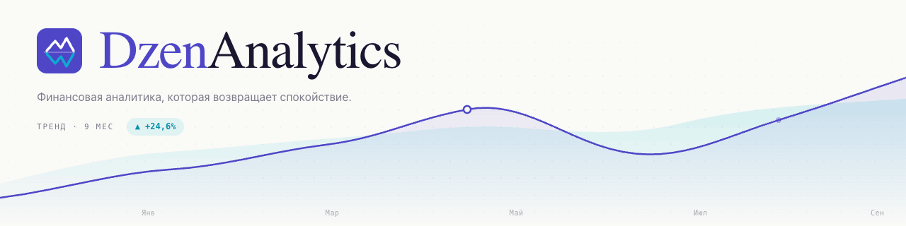

<p align="center">
  
</p>

> Современная локальная финансовая аналитика для [Дзен-мани](https://zenmoney.ru/) —
> с **онлайн-синхронизацией через API** или импортом CSV, дашбордом, графиками,
> прогнозами, бюджетами, целями FIRE, аномалиями, потоками Sankey, финансовым
> «здоровьем», what-if-сценариями и десятками других возможностей.

[](https://react.dev/)
[](https://www.typescriptlang.org/)
[](https://vite.dev/)
[](https://tailwindcss.com/)
[](LICENSE)

**100% локальная обработка. Никаких наших серверов. Никакой телеметрии.** Все данные
обрабатываются и хранятся в браузере (IndexedDB). CSV не покидает компьютер; при
работе через Zenmoney API запросы идут **напрямую** в `api.zenmoney.ru` без
посредников. По умолчанию приложение работает **в режиме чтения**; отправка
правок и удалений обратно в облако (двусторонняя синхронизация) — отдельная
функция, которую вы включаете осознанно и которая по умолчанию выключена.

---

## Содержание

- [Возможности](#возможности)
  - [Источники данных: CSV или Zenmoney API](#источники-данных-csv-или-zenmoney-api)
  - [Синхронизация с облаком, снимки и лог](#синхронизация-с-облаком-снимки-и-лог)
  - [Главный дашборд](#главный-дашборд)
  - [Операции и редактирование](#операции-и-редактирование)
  - [Аналитика и графики](#аналитика-и-графики)
  - [Планирование и цели](#планирование-и-цели)
  - [Финансовое здоровье и сценарии](#финансовое-здоровье-и-сценарии)
  - [Отчёты и дайджесты](#отчёты-и-дайджесты)
  - [Качество данных](#качество-данных)
  - [Поиск и навигация](#поиск-и-навигация)
  - [Удобство работы](#удобство-работы)
  - [Производительность и платформа](#производительность-и-платформа)
- [Онлайн-версия (тестовый режим)](#онлайн-версия-тестовый-режим)
- [Установка для нетехнических пользователей](#установка-для-нетехнических-пользователей)
- [Установка из исходников](#установка-из-исходников)
- [Подключение к Zenmoney API](#подключение-к-zenmoney-api)
- [Импорт CSV из Дзен-мани](#импорт-csv-из-дзен-мани)
- [Калибровка совокупного баланса](#калибровка-совокупного-баланса)
- [Мульти-валютность](#мульти-валютность)
- [Бэкапы по расписанию](#бэкапы-по-расписанию)
- [Сборка и деплой](#сборка-и-деплой)
- [Стек технологий](#стек-технологий)
- [Структура проекта](#структура-проекта)
- [Приватность и хранение данных](#приватность-и-хранение-данных)
- [Лицензия](#лицензия)

---

## Возможности

### Источники данных: CSV или Zenmoney API

Приложение работает с одним из двух источников (взаимоисключающих):

| Источник | Когда выбрать | Что даёт |
|---|---|---|
| **CSV-выгрузка** | Когда нет токена / нужен полный офлайн / разовая аналитика по выгрузке | Загрузка раз в месяц, всё локально, никакого исходящего трафика |
| **Zenmoney API** | Когда хочется «всё свежее всегда» и не возиться с экспортами | Авто-синхронизация, авто-калибровка net worth, иконки и цвета категорий, инкрементальные дельты |

Переключение между ними реализовано безопасно: если у вас уже загружен CSV
и вы подключаете API — приложение спросит подтверждение, и наоборот. **Локальные
правки операций** при этом сохраняются — они хранятся отдельным overlay-слоем
и переживают любую смену источника.

### Синхронизация с облаком, снимки и лог

При работе через Zenmoney API доступен полный цикл синхронизации (всё опционально
и настраивается на странице «Настройки» → вкладка «Данные»):

- **Чтение (по умолчанию)** — `↻ Обновить` тянет дельту, `⤓ Полная синхронизация`
  перекачивает всё заново. Иконку-кнопки есть и в шапке.
- **Авто-синхронизация по расписанию** — обновление данных из облака с заданным
  интервалом (число + единица: минуты / часы / дни). Работает, пока вкладка открыта.
- **Двусторонняя синхронизация (push)** — отправка локальных правок и удалений
  обратно в облако Дзен-мани. Три режима: **вручную** (кнопкой), **авто после
  правки** (через ~2 с после изменения), **при синхронизации** (вместе с каждым
  обновлением). По умолчанию выключено. Отправляются: дата, получатель, бренд,
  комментарий, сумма, валюта, категория, подкатегория, смена типа между
  Расход / Доход / Возврат и на/с «Перевод», смена счёта (в т.ч. счетов
  перевода), а также **мультивалютные** операции: смена типа на операциях в
  валюте, отличной от счёта; перевод между счетами разной валюты (с вводом
  суммы зачисления); перенос операции на счёт другой валюты. Перед отправкой
  проверяются конфликты: если операцию изменили в облаке после вашей
  синхронизации, правка не отправляется (останется в очереди) — чтобы не
  затереть чужое изменение.
- **Облачные снимки (safety net)** — полный «слепок» состояния облака, хранится
  локально (последние 5). Перед каждой отправкой правок снимок делается
  автоматически (политику можно настроить: каждый раз / раз в день / никогда),
  чтобы можно было откатиться к известному состоянию.
- **Лог синхронизаций** — таблица всех операций синка/отправки/удаления: тип,
  дата-время, число затронутых операций, длительность и статус (успешно / ошибка),
  с пагинацией. Ошибки видны сразу.

### Главный дашборд

Страница `/` — обзор всего и сразу:

- **4 hero-KPI**: совокупный баланс, доход за последний месяц с дельтой к предыдущему,
  расход с дельтой, норма сбережений
- **Cash-flow с прогнозом** на 3 месяца вперёд (среднее за последние 6 мес)
- **Совокупный баланс** — area-чарт нарастающего net worth с поддержкой калибровки
- **Авто-инсайты** — топ-6 наблюдений (самая крупная трата, тренды MoM, рост категорий, и т.д.)
- **Топ-7 категорий расходов** с прогресс-барами
- **Крупнейшие траты** — top-5 операций
- **Ближайшие регулярные платежи** — top-5 предстоящих + общая месячная нагрузка
- **Mini-heatmap** активности за 90 дней (GitHub-style)
- **Структура расходов** — фиксированные / дискретные / без флага + KPI «свободные деньги»
- **Quick-link плитки** — Календарь / Хэштеги / Сравнение / Регулярные
- **Калибровка** — баннер с быстрым вводом текущего совокупного баланса
- **Аннотации** — вертикальные линии на графике совокупного баланса
- **Снимок PNG** — экспорт всего дашборда в PNG-файл (через `html-to-image`)

### Операции и редактирование

Страница `/transactions` — сквозная лента всех операций под глобальными фильтрами:

- **KPI-сводка** наверху (доходы / расходы / чистый / количество) — пересчитывается
  по фильтрам + локальному поиску
- **Группировка по дням** при сортировке по дате — «Сегодня», «Вчера», полные
  даты. Шапка дня показывает количество операций и суммы +/− с подсветкой
- **Сортировка** по дате (новые/старые) или сумме (крупные/мелкие)
- **Локальный поиск** по получателю/комментарию/категории/счёту
- **CSV-экспорт** текущей выборки
- **Lazy-скролл** через IntersectionObserver — первые 100 строк сразу,
  следующие подгружаются по приближению к концу. Работает плавно
  даже на 10+ тысячах операций
- **Фиксированные колонки** на CSS-Grid: ширина не «гуляет» между днями,
  длинный текст усекается многоточием, полное содержимое — в tooltip-е
- **Редактирование операции** — двойной клик по строке (или иконка ✏️):
  - Тип операции (Расход / Доход / Перевод / Возврат), категория +
    подкатегория с автодополнением (фильтр по типу операции)
  - Получатель, комментарий, сумма, валюта, счёт, дата
  - Получатель умеет автодополнять из словаря брендов Дзен-мани; имя, которого
    нет в словаре, сохраняется как свободный текст
  - Правки сохраняются локально как overlay поверх данных и переживают синк.
    При включённой двусторонней синхронизации могут отправляться в облако
  - Изменённые строки помечены иконкой ✏️ в списке
- **Удаление операции** — кнопка 🗑️ в карточке операции и в ленте рядом с
  редактированием. Операция скрывается из всех расчётов и графиков; при
  включённой двусторонней синхронизации удаляется и в облаке Дзен-мани
- **Корзина «Удалённые»** — кнопка в тулбаре «Операции» открывает страницу
  (`/trash`) со всеми скрытыми операциями. Любую можно **восстановить** одним
  кликом — она вернётся во все расчёты, а при двусторонней синхронизации
  ещё и обратно в облако Дзен-мани (страховка от случайного удаления)
- **Массовое удаление** — в плавающей панели множественного выбора есть
  кнопка «Удалить»: скрыть сразу все отмеченные операции одним действием
- **Массовое редактирование** — отметьте чекбоксами несколько строк (или
  «выделить все»), и в плавающей панели снизу нажмите «Изменить». Одним
  действием меняются Категория (+подкатегория), Получатель и/или Комментарий
  у всех выбранных операций; пустое поле оставляет значение без изменений.
  Доступно везде, где есть список операций: лента «Операции», окна
  детализации (drill-down), результаты «Поиска» и «Дубликаты»

### Аналитика и графики

| Раздел | Что внутри |
|---|---|
| **Cash-flow** (`/cashflow`, в меню «Ещё») | Месячные бары доходов/расходов + линия чистого потока + прогноз 3 сценария (оптимист/реалист/пессимист) + год к году + аннотации + stream graph по категориям + сезонность |
| **Категории** (`/categories`) | Donut-чарт, treemap, bar-chart; иерархия с раскрытием подкатегорий; флаги «фиксированная»/«дискретная» 🔒/☕; кликабельные сегменты |
| **Счета** (`/accounts`) | Список счетов в двух видах (**карточки / таблица**) с актуальным балансом счёта (в API-режиме — полной суммой из Дзен-мани, в т.ч. в валюте счёта; в CSV — изменением по фильтрам), изменением за период, поступлениями/списаниями и sparkline; stacked area-чарт по топ-8 счетам, area-линия совокупного баланса, drill-down по любому счёту, **калибровка совокупного баланса**. Показываются **все реальные счета** из Дзен-мани, влияющие на баланс (даже без операций за период), а **кредитки и долги отображаются с минусом** (красным) и корректно уменьшают итоговые суммы |
| **Тренды** (`/trends`) | Помесячный таймлайн категорий, bar-chart по дням недели, radar-диаграмма, heatmap «час недели» (24×7), KPI «будни vs выходные» |
| **Календарь** (`/calendar`) | GitHub-style тепловая карта по дням всего года, 9 градаций цвета (квантильное распределение), переключатель год/расходы-доходы, клик по дню → drawer |
| **Топ** (`/top`) | Сортируемые таблицы: топ-категории / топ-получатели / топ-операции, экспорт в CSV |
| **Сравнение** (`/compare`) | Сравнение двух периодов: пресеты (месяц/пред. месяц, YTD vs прошлый YTD, 30/30, 90/90) или свои даты, дельты со стрелками, bar-chart по категориям |
| **Хэштеги** (`/tags`) | Облако и таблица тегов из комментариев (#Mazda3, #Катя), drill-down по тегу |
| **Облако слов** (`/wordcloud`) | Топ-слов в комментариях — размер по частоте, кликабельные |
| **Потоки** (`/sankey`) | Sankey-диаграмма: источники доходов → бюджет → категории расходов |

### Планирование и цели

- **Бюджет** (`/budgets`) — план/факт по категориям с переключателем месяца.
  Расходные и доходные лимиты, периодичность (ежемес./квартал/год/разово) и окно
  действия (даты «с»/«по»); квартальные/годовые суммы падают на один месяц периода.
  Правка плана на конкретный месяц + «сделать нормой» для переноса вперёд. Прогресс-бары
  с цветами, маркер прогресса месяца, прогноз перерасхода
- **Цели + FIRE** (`/goals`) — копить на машину/отпуск/подушку с прогресс-баром и
  расчётом срока достижения. Блок FIRE: норма сбережений, годовой расход × 25, текущий
  капитал (сумма выбранных счетов, включая накопительные вне баланса) и лет до
  финансовой свободы от него, сценарии 10/20/30/50%
- **Регулярные** (`/recurring`) — авто-детект подписок и регулярных трат: одинаковый
  payee + ~стабильная сумма + интервал 5–95 дней + минимум 3 повтора. Прогноз ближайших
  платежей и общая месячная нагрузка; «протухшие» (молчат дольше ~2 циклов периодичности)
  прячутся по умолчанию

### Финансовое здоровье и сценарии

- **Здоровье** (`/health`) — интегральный KPI 0–100 + буквенная оценка (A+…E) на основе
  5 взвешенных метрик: норма сбережений, покрытие подушки безопасности, чистота
  категоризации, стабильность сбережений (CV), доля фиксированных в доходе. Каждой
  слабой метрике — конкретная рекомендация
- **Что-если** (`/whatif`) — слайдеры дохода/расхода/категорий + дополнительная сумма
  «отложить в месяц» + стартовый капитал. Real-time пересчёт: новая норма сбережений,
  лет до FIRE с дельтой к текущей траектории, прогноз капитала через 1 / 5 / 10 лет

### Отчёты и дайджесты

- **Год в цифрах** (`/year-review`) — сводный отчёт за выбранный год: суммарный доход
  и расход с дельтами к прошлому году, лучший/худший/рекордный месяц, топ-8 категорий
  и получателей с прогресс-барами, топ-5 самых дорогих покупок, «любопытные факты»
  (средний расход в день, любимый день недели, серия дней без трат, и др.). Экспорт
  в PNG для шеринга
- **Дайджест** (`/digest`) — авто-сгенерированные итоги по неделям (последние 26)
  и месяцам со сравнением с предыдущим периодом. Категории «где выстрелило» с
  абсолютным изменением в деньгах, топ-5 операций периода. Сайдбар-история

### Качество данных

- **Аномалии** (`/anomalies`) — операции-выбросы (z-score > 2.5σ по категории/payee,
  чувствительность регулируется ползунком) и всплески по категориям (категория выросла
  в 1.5×+ к среднему за 3 предыдущих месяца)
- **Дубликаты** (`/duplicates`) — авто-детект подозрительно похожих операций
  (одинаковая сумма + получатель + тип в окне 1–14 дней)
- **Без категории** (`/uncategorized`) — операции с пустой категорией или «Прочие»,
  плюс **smart suggestions**: алгоритм предлагает категорию по похожим операциям
  и создаёт правила одним кликом

### Поиск и навигация

- **Командная палитра** (Ctrl+K / ⌘K / `/`) — fuzzy-поиск по всем 25 страницам,
  категориям, получателям, месяцам и сохранённым видам. Запускает действия (смена темы,
  сброс фильтров и т.п.). Навигация ↑↓, Enter, Esc
- **Горячие клавиши**: `Ctrl/⌘+K` или `/` — палитра, `g d` — Главная, `g c` — Cash-flow,
  `g k` — Категории, `g a` — Счета, `g t` — Тренды, `g b` — Бюджеты, `g s` — Поиск,
  `g h` — Справка, `Esc` — закрыть drawer/палитру
- **Глобальный поиск** (`/search`) — полнотекст по получателю/комментарию/категории/счёту,
  AND по словам через пробел, поле «исключить», опциональный regex, диапазон дат и сумм,
  фильтр по типу
- **Глобальные фильтры** на всех аналитических страницах:
  - Период: пресеты `30 дней / 3 мес / 6 мес / 12 мес / YTD / Всё` или свои даты
  - **Быстрая навигация по месяцам** — шевроны `← Месяц →` для пошагового перехода
  - Счета / категории / валюты — мульти-выбор
  - Поиск по получателю и комментарию
  - Чекбокс «без переводов»
  - **Сохранённые виды (saved views)** — сохранить комбинацию фильтров и переключаться одним кликом

### Удобство работы

- **Drill-down drawer** — клик по любому графику / строке таблицы / карточке открывает
  fullscreen-панель со списком операций (дата, категория, получатель, **полный комментарий**,
  счёт, сумма). Поиск, сортировка по 4 колонкам, KPI-сводка, экспорт выборки в CSV,
  редактирование/удаление и **множественный выбор** для массовой правки.
  Закрывается **Esc** или кнопкой в правом верхнем углу
- **Полные суммы** — KPI, карточки, таблицы и тултипы показывают суммы целиком,
  без сокращений `млн`/`тыс.` (компактная запись остаётся только на осях графиков)
- **Формат сумм (копейки)** — глобальный переключатель «Без дробной части /
  С дробной частью» в «Настройки → Валюты»: суммы по всему приложению
  показываются либо округлёнными до целого, либо с двумя знаками (копейки,
  центы — в зависимости от валюты). На осях графиков всегда компактный вид
- **Русский календарь** — поля выбора даты используют собственный календарь
  полностью на русском (никакого английского от браузерного `input type=date`):
  месяцы и дни недели по-русски, быстрый выбор месяца и года в два клика
- **«Похожие операции»** — кнопки в drawer'е: «По категории» / «По получателю»
- **Темы** — Светлая (по умолчанию) / Тёмная / **Авто** (`prefers-color-scheme` системы
  + по часам: 20:00–07:00 → тёмная)
- **Аннотации** (`/annotations`) — заметки на временной шкале, отображаются вертикальной
  линией на графиках. «Зарплата выросла», «Купил машину», и т.п.
- **Группировка похожих получателей** — `Магнит` / `Магнит #1234` / `MAGNIT-MOSCOW`
  → один payee. Toggle обратимый, оригиналы сохраняются. На вкладке
  «Настройки → Обработка» видны все авто-группировки, цель каждой можно
  поправить вручную
- **Поправка на инфляцию** — сравнение трат разных лет в реальных деньгах базового года.
  Редактируемые ставки CPI по годам
- **Сортируемые таблицы** — на всех страницах с табличными данными: клик по заголовку
  колонки переключает направление, активная колонка подсвечена, **экспорт в CSV**
- **Бэкап/restore JSON** — экспорт всей базы (транзакции + бюджеты + цели + калибровка
  + виды + аннотации + флаги категорий + инфляция + настройка группировки + правила +
  локальные правки) в один файл и импорт обратно. Можно настроить **авто-бэкап**
  по расписанию (день/неделя/месяц) — ссылка автоматически предлагает скачать файл
- **Merge-import** — режим «дополнить» при импорте свежего CSV (дедуп по `id`),
  режим «заменить» полностью
- **Правила категоризации** (`/rules`) — «если получатель содержит "Магнит", то
  категория = Еда дома». Поля: `payee` / `comment` / `category`. Операции: `contains`
  / `equals` / `starts_with` / `regex`. Порядок применения настраивается, превью
  совпадений в drawer'е, обратимо (оригинальные категории сохранены)
- **Справка** (`/help`) — встроенный путеводитель: по каждому пункту меню — что это,
  для чего и как работает; концепции FIRE, σ в аномалиях, флаги категорий, базовая
  валюта, инфляция и т.д.

### Производительность и платформа

- **PWA** — устанавливается как нативное приложение в Windows / macOS / Android.
  Service worker кеширует статику, приложение работает офлайн (после первого захода).
  Манифест с иконкой, темой и orientation; `apple-touch-icon` для iOS
- **Standalone-релиз** — отдельный single-file `DzenAnalytics.html`, который
  открывается двойным кликом из любого браузера без установки или хостинга. Все
  ассеты (JS, CSS, иконки) инлайнятся в один HTML
- **Mobile-friendly** — адаптивный layout: на мобильных навигация уезжает в боковую
  панель (гамбургер), таблицы остаются скроллируемыми, drawer — на весь экран
- **Темы** — Светлая / Тёмная / Авто (по системе и времени суток). Statusbar-цвет
  тоже адаптируется через `meta theme-color`

---

## Онлайн-версия (тестовый режим)

Если не хочется (или не получается) запускать сервис локально — есть готовая
онлайн-версия: **[dzenanalytics.zentable.ru](https://dzenanalytics.zentable.ru)**.
Открываете в браузере и сразу пользуетесь, ничего устанавливать не нужно.

> Сервис работает в **тестовом режиме**, поэтому возможны перебои и изменения.
> Как и в локальной версии, данные обрабатываются и хранятся **в вашем браузере**
> (IndexedDB), а при работе через Zenmoney API запросы идут напрямую в
> `api.zenmoney.ru`. Если нужен полный офлайн и максимальный контроль — используйте
> standalone-релиз или локальный запуск (ниже).

---

## Установка для нетехнических пользователей

Если не хочется возиться с Node.js и `npm` — скачайте готовый standalone-релиз:

1. Откройте [страницу релизов](https://github.com/DEADover/DzenAnalytics/releases/latest)
2. Скачайте `DzenAnalytics-vX.Y.Z-standalone.zip` (~300 КБ)
3. Распакуйте архив
4. Дважды кликните по `DzenAnalytics.html` — откроется ваш браузер с приложением

Всё. Никаких установок, серверов, интернета. 100% офлайн, данные хранятся в браузере.

> **Важно:** IndexedDB браузера привязана к origin'у — если перенесёте HTML-файл в
> другую папку, браузер не увидит ранее сохранённые данные. Выберите одно место и не
> переносите файл; для переноса данных используйте JSON-backup со страницы «Настройки».

---

## Установка из исходников

### Требования

- **Node.js** 20.19+ или 22.12+ (требование Vite 8; рекомендуется 22 LTS или
  новее — Docker-образ собирается на Node 26)
- **npm** 9+ (или `pnpm` / `yarn`)

### Локальный запуск

```bash
git clone https://github.com/DEADover/DzenAnalytics.git
cd DzenAnalytics
npm install
npm run dev
```

Откройте в браузере: **http://127.0.0.1:3030/**

> 💡 **Почему 3030, а не 5173?** На Windows стандартный порт Vite (5173) часто
> попадает в зарезервированный Hyper-V диапазон. В `vite.config.ts` зафиксирован
> свободный порт 3030.

### Первый запуск

1. Откройте `http://127.0.0.1:3030/settings`
2. Перетащите CSV-файл или кликните, чтобы выбрать
3. Дождитесь обработки (1.5 МБ / ~7000 операций обрабатываются за секунды)
4. Перейдите на «Главную» — все разделы оживут

Можно сразу попробовать на синтетических данных за 5 лет: `sample/demo-2021-2026.csv`.

---

## Подключение к Zenmoney API

Самый быстрый способ получить «всегда свежие» данные — подключить
[Zenmoney API](https://github.com/zenmoney/ZenPlugins/wiki/ZenMoney-API).

### Получение токена

Официальный путь — OAuth-флоу через ваш собственный consumer (см.
[Zenmoney API Wiki](https://github.com/zenmoney/ZenPlugins/wiki/ZenMoney-API)),
но регистрировать приложение ради личного токена избыточно. Разработчики Дзен-мани
рекомендует обычным пользователям использовать готовый сервис:

1. Откройте [**zerro.app/token**](https://zerro.app/token) (открытый
   проект, [исходники на GitHub](https://github.com/ardov/zerro))
2. Войдите своим логином от Дзен-мани — на странице токена откроется
   стандартное OAuth-окно Дзен-мани
3. Подтвердите доступ — Zerro покажет ваш personal access token
4. Скопируйте длинную строку токена

> Что важно про zerro.app: это OAuth-посредник, токен **выпускает сам
> Дзен-мани**, Zerro его не сохраняет на своих серверах. Если когда-нибудь
> захотите отозвать доступ — это делается в Дзен-мани → Настройки →
> Подключённые приложения.
>
> Если хочется обойтись без посредников совсем — заведите свой consumer в
> Zenmoney и пройдите OAuth самостоятельно. Это сложнее: нужно поднять
> redirect-URI, обработать `code → token` обмен и т.д.

### Подключение

1. Откройте страницу **Настройки** (⚙️ в шапке)
2. В блоке «Источник данных» переключите режим на **Онлайн (Zenmoney API)**
3. Вставьте токен → «Подключить»
4. Дождитесь первой полной синхронизации (несколько секунд для большинства баз)

### Что происходит дальше

- **Single-endpoint sync**: всё через `POST https://api.zenmoney.ru/v8/diff/`
  с заголовком `Authorization: Bearer <ваш токен>`
- **Чтение по умолчанию**: при обычной синхронизации тело запроса содержит
  только `currentClientTimestamp` + `serverTimestamp` — никаких изменений в
  облако не уходит. Отправка правок/удалений (секции `transaction` / `deletion`)
  происходит **только** если вы явно включили двустороннюю синхронизацию в
  настройках; по умолчанию она выключена
- **Локальный entity-cache**: сущности `user / account / tag / instrument /
  transaction / merchant` хранятся в IndexedDB; повторный синк отправляет
  `lastServerTimestamp` и тянет только дельту
- **Базовая валюта** берётся из `user.currency` (instrument id) — по умолчанию
  совпадает с вашими настройками в Дзен-мани
- **Курсы валют** подтягиваются из `instrument.rate` (всегда свежие); таблица
  курсов в UI скрывается, остаётся только переключатель базовой валюты
- **Авто-калибровка** совокупного баланса: при каждом синке `account.balance`
  агрегируется автоматически — ручную калибровку проставлять не нужно
- **Иконки и цвета** категорий приходят из `tag.icon` / `tag.color`
  (ARGB-int → CSS rgba) и применяются в UI на всех страницах
- **Авто-синхронизация по расписанию** — настраиваемый интервал (число +
  минуты / часы / дни) в настройках; работает, пока вкладка открыта
- **Двусторонняя синхронизация (опционально)** — отправка локальных правок и
  удалений обратно в облако (вручную / авто после правки / при синхронизации).
  Перед отправкой автоматически делается облачный снимок-страховка. По
  умолчанию выключено

### Безопасность токена

- Токен **никогда не попадает в git** (это критически важно — `.env` в репо
  нет; токен живёт исключительно в IndexedDB браузера)
- При отключении API («Удалить токен») — токен, entity-cache, кэш
  category-meta стираются за один вызов
- При сборке `standalone`-релиза токен в HTML не зашит — это статический
  бандл без данных

---

## Импорт CSV из Дзен-мани

### Как получить файл

1. Откройте Дзен-мани → Настройки → Архивация → Экспорт в CSV
2. Скачается файл вида `zen_2026-05-01_dumpof_transactions_<id>.csv`

### Поддерживаемый формат

Разделитель `;`, кодировка UTF-8, шапка:

```
date;categoryName;payee;comment;outcomeAccountName;outcome;outcomeCurrencyShortTitle;incomeAccountName;income;incomeCurrencyShortTitle;createdDate;changedDate;qrCode
```

- Категории парсятся по `" / "`: `Еда дома / Алкоголь` → category=`Еда дома`, subcategory=`Алкоголь`
- Транзакция классифицируется автоматически:
  - `outcome > 0, income = 0` → расход
  - `outcome = 0, income > 0` → доход
  - `outcome > 0, income > 0` с разными счетами → перевод
- Хэштеги из комментариев (`#Mazda3`, `#Катя`) извлекаются автоматически

### Режимы импорта

- **Заменить** — старые данные стираются, грузится новый файл
- **Дополнить** — новые операции добавляются, дубликаты по `id` отбрасываются.
  Удобно для регулярного обновления данных каждый месяц

---

## Калибровка совокупного баланса

CSV-выгрузка Дзен-мани **не содержит начальных остатков счетов** — только
последовательность операций. Поэтому без калибровки «совокупный баланс» — это
`сумма доходов − сумма расходов` от начала истории, а не реальный остаток на
счетах.

### В режиме Zenmoney API — калибровка не нужна

При подключённом токене стартовые остатки берутся прямо из ответа API
(`account.balance` + `account.startBalance`). Приложение само пересчитывает
совокупный баланс при каждом синке. Панель калибровки на странице «Счета» и
баннер на Главной в этом режиме скрыты — настраивать нечего.

### В режиме CSV — есть три способа откалибровать

1. **Баннер на Главной** — введите вашу текущую сумму на всех счетах. График и
   KPI сдвинутся на разницу, и любая прошлая точка истории покажет реальное
   значение.
2. **Панель «Калибровка» на странице Счета** — то же самое, но с возможностью
   указать произвольную дату и сумму.
3. **Авто-детект якорных операций** — приложение находит в CSV специальные
   операции (категории «Начальный остаток», «Корректировка остатка» и т.п.) и
   предлагает применить их одним кликом.

---

## Мульти-валютность

DzenAnalytics сводит операции в разных валютах в одну **базовую валюту** — в ней
показываются все KPI, графики и совокупный баланс. Поведение мульти-валютности
зависит от выбранного источника данных.

### В режиме Zenmoney API

При подключении токена приложение получает курсы и валюты **прямо из вашего
аккаунта Дзен-мани** — настраивать вручную ничего не нужно:

- **Базовая валюта** автоматически берётся из настроек профиля Дзен-мани
  (`user.currency` → `instrument.shortTitle`). Если у вас в Дзен-мани базовая
  USD — здесь тоже будет USD из коробки. В UI остаётся только переключатель
  базовой валюты, если захочется посмотреть на свои финансы в другой.
- **Курсы** приходят из сущности `instrument` (Zenmoney хранит их как «1 X =
  rate RUB»). На каждом синке курсы обновляются — это всегда свежие межбанковские
  значения. Таблица курсов в UI скрывается (нечего там настраивать).
- **Все валюты** из вашего аккаунта подтягиваются автоматически, включая
  экзотические (`KGS`, `UZS`, `ILS`, `XBT` и т.п.). Нет ручного «добавьте, если
  не хватает».

### В режиме CSV

Когда работаете офлайн (без токена):

- **Базовая валюта** выбирается на странице «Настройки» из списка известных.
  По умолчанию `RUB`.
- **Курсы** редактируете руками: таблица «1 X = N БазВал» доступна на странице
  настроек. Все агрегации пересчитываются на лету.
- **Дефолтный набор** на старте: `RUB / USD / EUR / GBP / CNY / JPY / KZT / BYN
  / GEL / AMD / AED / TRY / THB` со стартовыми курсами относительно RUB
  (приблизительные значения как стартовая точка, замените на актуальные).
- **Новые валюты из CSV** добавляются автоматически со значением `1` —
  отрегулируете руками после первого импорта.

### Общее для обоих режимов

- **Смена базовой валюты** мгновенно пересчитывает всё. Под капотом — re-anchor
  с RUB на новую базу: `new[X] = old[X] / old[НоваяБаза]`, округление до 6 знаков
  для читаемости. При попытке выбрать валюту, у которой курс отсутствует или
  равен 0 — переключение блокируется с понятной подсказкой.
- **Локальные правки операций** хранят сумму и валюту независимо. Если в drawer
  вы изменили валюту операции — приложение пересчитает её в базе по текущему
  курсу.
- **Счета в нативной валюте** на странице «Счета» и в drawer-е по счёту
  показываются в исходной валюте с переводом в базу (например, «$463,61 ·
  33 902,64 ₽»). Совокупный баланс — всегда в базовой валюте.

---

## Бэкапы по расписанию

На странице **Настройки** → вкладка «Бэкапы» резервные копии разделены на
**локальные** и **облачные**.

**Локальные** (JSON-файл на ваше устройство):

- **Скачать прямо сейчас** — выгружает в JSON всю локальную базу одним
  файлом (транзакции, бюджеты, цели, калибровка, виды, аннотации, флаги
  категорий, инфляция, правила, **локальные правки операций**, настройки)
- **Авто-бэкап** по расписанию — приложение само инициирует скачивание
  свежего JSON-файла раз в день / неделю / месяц при заходе на сайт.
  Полезно, если активно правите данные локально или часто переключаетесь
  между устройствами

Восстановление — кнопка «Загрузить из бэкапа» в том же блоке. **Импорт
полностью заменяет** текущую базу — поэтому перед восстановлением
полезно сделать актуальный бэкап существующего состояния.

**Облачные** (снимки состояния Дзен-мани, только при подключённом API):

- **Облачный снимок** — полный «слепок» того, что лежит в облаке, хранится
  локально (последние 5). Делается вручную кнопкой или автоматически перед
  каждой отправкой правок (двусторонняя синхронизация). Снимок можно скачать
  или восстановить обратно в облако — страховка на случай неудачного push'а.

> При работе через standalone-HTML каждое перемещение файла → новый origin
> в браузере → пустая база. Бэкап — единственный надёжный способ
> переноса данных в этом сценарии.

---

## Сборка и деплой

### Production-сборка

```bash
npm run build              # → dist/ (для веб-хостинга)
npm run preview            # отдать собранный dist локально
```

### Standalone single-file релиз

```bash
npm run release:zip        # → release/DzenAnalytics-vX.Y.Z-standalone.zip
```

Получится один HTML (~1 МБ, ~300 КБ в zip) с инлайн-JS/CSS/иконками. Двойной клик —
работает в любом современном браузере на Windows, macOS, Linux. На `file://`
автоматически переключается с `BrowserRouter` на `HashRouter` и отключает service
worker.

### Деплой на статик-хостинг

Обычная сборка (`npm run build`) даёт статический сайт ~280 КБ (gzip), всё на клиенте.
Поскольку приложение полностью frontend, его можно бесплатно разместить где угодно:

- **Vercel** — `vercel deploy --prod`
- **Netlify** — `netlify deploy --prod --dir=dist`
- **GitHub Pages** — push `dist/` в ветку `gh-pages`
- **Cloudflare Pages** — connect репо в дашборде

> Учтите: SPA-роутинг требует rewrite всех путей на `index.html`.
> Vercel и Netlify делают это сами; для GH Pages потребуется `404.html`-хак.

### Запуск через Docker

Для самостоятельного хостинга в репозитории есть готовый Docker-сетап
(`Dockerfile` + `docker-compose.yaml` + `nginx.conf`). Multi-stage сборка:
приложение собирается в Node, а раздаётся через nginx с SPA-фолбэком,
security-заголовками и кэшированием статики.

```bash
docker compose up -d --build      # собрать и поднять → http://localhost:8000
```

Порт по умолчанию — `8000`, меняется переменной `LISTEN_PORT`:

```bash
LISTEN_PORT=3000 docker compose up -d --build   # → http://localhost:3000
```

Без compose:

```bash
docker build -t dzenanalytics .
docker run -d -p 8000:8000 --restart unless-stopped dzenanalytics
```

> Хостинг лишь раздаёт статический фронтенд — данные по-прежнему остаются
> в браузере каждого пользователя (IndexedDB) и никуда не уходят. Поднимать
> можно хоть в локальной сети, хоть за reverse-proxy.

---

## Стек технологий

### Core
- **React 19** + **TypeScript 5** + **Vite 8**
- **Tailwind CSS** для стилей (с CSS-переменными для тем)

### Visualization
- **Recharts** — все графики (line/area/bar/pie/treemap/sankey/radar)
- Кастомные SVG-компоненты:
  - `Sparkline` (отдельный компонент) — мини-линии в карточках счетов
  - `MiniHeatmap` (inline в DashboardPage) — компактная тепловая карта 90 дней
  - `HourOfWeekHeatmap` (inline в TrendsPage) — 24×7 матрица

### Data
- **PapaParse** — парсинг CSV
- **IndexedDB** через `idb` — персистентность всей базы между сессиями
- **Zustand** — реактивный стейт (20+ сторов: data, filters, drill, theme,
  budgets, goals, calibration, savedViews, annotations, categoryFlags, inflation,
  categoryRules, payeeAlias, reportPeriod, zenmoney, categoryMeta, edits, deleted,
  cloudSnapshot, syncLog, confirm, backup)

### Standalone build
- **vite-plugin-singlefile** — всё в один HTML
- Кастомный плагин `inline-standalone-assets` инлайнит favicon/apple-touch-icon
  как data URI, чтобы вкладка показывала иконку и из `file://`

### Utility
- `date-fns`, `lucide-react`, `clsx`, `html-to-image`

---

## Структура проекта

```
DzenAnalytics/
├── src/
│   ├── pages/                         # 27 маршрутов
│   │   │
│   │   │   # Основное (top-nav)
│   │   ├── DashboardPage.tsx          # /              главный дашборд
│   │   ├── TransactionsPage.tsx       # /transactions  сквозная лента + lazy-скролл
│   │   ├── AccountsPage.tsx           # /accounts      счета + (авто)калибровка net worth
│   │   ├── CategoriesPage.tsx         # /categories    donut + treemap + bar + флаги 🔒/☕
│   │   ├── TrendsPage.tsx             # /trends        дни недели, час недели, radar
│   │   ├── GoalsPage.tsx              # /goals         цели накопления + блок FIRE
│   │   │
│   │   │   # Аналитика «Ещё»
│   │   ├── CashflowPage.tsx           # /cashflow      cash-flow, прогноз, stream, сезонность
│   │   ├── BudgetsPage.tsx            # /budgets       месячные лимиты по категориям
│   │   ├── RecurringPage.tsx          # /recurring     авто-детект подписок и платежей
│   │   │
│   │   │   # Здоровье и сценарии
│   │   ├── HealthPage.tsx             # /health        интегральный score 0–100, A+…E
│   │   ├── WhatIfPage.tsx             # /whatif        слайдеры → real-time пересчёт
│   │   │
│   │   │   # Отчёты
│   │   ├── YearReviewPage.tsx         # /year-review   итоги года + PNG-экспорт
│   │   ├── DigestPage.tsx             # /digest        дайджесты недель/месяцев
│   │   │
│   │   │   # Аналитика и срезы
│   │   ├── CalendarPage.tsx           # /calendar      GitHub-style тепловая карта года
│   │   ├── TopPage.tsx                # /top           топ-категории/получатели/операции
│   │   ├── ComparePage.tsx            # /compare       сравнение двух периодов
│   │   ├── SankeyPage.tsx             # /sankey        потоки доход → расход
│   │   ├── TagsPage.tsx               # /tags          хэштеги из комментариев
│   │   ├── WordcloudPage.tsx          # /wordcloud     облако слов в комментариях
│   │   │
│   │   │   # Качество данных
│   │   ├── AnomaliesPage.tsx          # /anomalies     z-score > 2.5σ + MoM-всплески
│   │   ├── DuplicatesPage.tsx         # /duplicates    похожие операции
│   │   ├── UncategorizedPage.tsx      # /uncategorized дыры + smart suggestions
│   │   │
│   │   │   # Прочее
│   │   ├── AnnotationsPage.tsx        # /annotations   заметки на временной шкале
│   │   ├── RulesPage.tsx              # /rules         правила категоризации
│   │   ├── SearchPage.tsx             # /search        глобальный полнотекст
│   │   ├── HelpPage.tsx               # /help          встроенная справка по меню
│   │   └── ImportPage.tsx             # /settings      настройки: вкладки Данные / Валюты / Обработка / Бэкапы
│   │
│   ├── components/                    # переиспользуемые компоненты
│   │   ├── TopNav.tsx                 # шапка с брендовым лого + иконки ⚙️ ❓
│   │   ├── HeaderSyncActions.tsx      # кнопки синка ↻ / ⤓ в шапке
│   │   ├── GlobalFilters.tsx          # фильтры с шевронами месяцев + saved views
│   │   ├── TransactionsDrawer.tsx     # fullscreen drawer для drill-down
│   │   ├── EditTransactionModal.tsx   # редактирование/удаление операции (overlay)
│   │   ├── ConfirmDialog.tsx          # модальное подтверждение (по центру, blur-фон)
│   │   ├── SyncLog.tsx                # таблица лога синхронизаций
│   │   ├── CategoryDot.tsx            # цветной значок-эмодзи категории из API
│   │   ├── Combobox.tsx               # автодополнение с bounded-dropdown
│   │   ├── SortableTable.tsx          # сортируемая таблица + CSV-экспорт
│   │   ├── CommandPalette.tsx         # ⌘K палитра + горячие клавиши
│   │   ├── QuickCalibration.tsx       # баннер калибровки (скрыт при API)
│   │   ├── InsightsPanel.tsx          # авто-наблюдения на главной
│   │   ├── ThemeSwitcher.tsx          # светлая/тёмная (pill-toggle)
│   │   ├── Sparkline.tsx              # SVG-мини-линия (в карточках счетов)
│   │   ├── Stat.tsx                   # KPI-карточка
│   │   └── EmptyState.tsx             # «нет данных»
│   │
│   ├── store/                         # ~22 Zustand-стора (все персистятся в IndexedDB)
│   │   ├── useDataStore.ts            # transactions + transactionsRaw + rates
│   │   ├── useFiltersStore.ts         # период / счета / категории / поиск
│   │   ├── useDrillStore.ts           # drawer state
│   │   ├── useThemeStore.ts           # тема + auto-by-time
│   │   ├── useBudgetsStore.ts         # лимиты по категориям
│   │   ├── useGoalsStore.ts           # цели накопления
│   │   ├── useCalibrationStore.ts     # калибровка совокупного баланса
│   │   ├── useSavedViewsStore.ts      # сохранённые комбинации фильтров
│   │   ├── useAnnotationsStore.ts     # заметки на временной шкале
│   │   ├── useCategoryFlagsStore.ts   # флаги 🔒/☕
│   │   ├── useCategoryRulesStore.ts   # правила перезаписи категорий
│   │   ├── useInflationStore.ts       # CPI по годам + поправка
│   │   ├── usePayeeAliasStore.ts      # ручные объединения получателей
│   │   ├── useReportPeriodStore.ts    # первый день отчётного месяца
│   │   ├── useZenmoneyStore.ts        # токен/sync/push state Zenmoney API
│   │   ├── useCategoryMetaStore.ts    # icon/color категорий из API
│   │   ├── useEditsStore.ts           # локальные правки операций (overlay)
│   │   ├── useDeletedStore.ts         # локально удалённые (скрытые) операции
│   │   ├── useCloudSnapshotStore.ts   # облачные снимки (safety net)
│   │   ├── useSyncLogStore.ts         # лог синхронизаций / push / удалений
│   │   ├── useConfirmStore.ts         # императивные модальные подтверждения
│   │   └── useBackupStore.ts          # настройки авто-бэкапа
│   │
│   ├── lib/zenmoney.ts                # клиент /v8/diff/ (pull + push)
│   ├── lib/zenmoneyCache.ts           # entity-cache + applyDiff (merge/deletions)
│   ├── lib/zenmoneyMap.ts             # маппинг Zenmoney diff → Transaction[]
│   ├── lib/zenmoneyPush.ts            # обратный маппинг Transaction-правок → push
│   ├── lib/cloudSnapshots.ts          # облачные снимки (safety net) + restore
│   ├── lib/zenIconEmoji.ts            # mapping ~165 Zen icon IDs → emoji
│   ├── lib/devLog.ts                  # dev-only лог-сток (гейтится PROD)
│   │
│   ├── lib/                           # чистая логика, без React
│   │   ├── aggregations.ts            # все группировки и расчёты (~30 экспортов)
│   │   ├── health.ts                  # финансовое здоровье (5 компонентов)
│   │   ├── whatif.ts                  # what-if симулятор
│   │   ├── yearReview.ts              # годовой отчёт
│   │   ├── digest.ts                  # дайджесты недель/месяцев
│   │   ├── csv.ts                     # парсер Дзен-мани CSV
│   │   ├── db.ts                      # IndexedDB через `idb`
│   │   ├── format.ts                  # числа / даты / валюты / темовые цвета
│   │   └── payeeNormalize.ts          # fuzzy-grouping получателей
│   │
│   ├── assets/
│   │   └── logo-mark.svg              # брендовый mark (инлайнится Vite в standalone)
│   │
│   ├── App.tsx                        # роутер (BrowserRouter↔HashRouter авто)
│   ├── main.tsx                       # entrypoint + SW registration
│   ├── types.ts                       # глобальные типы (Transaction, RawRow, …)
│   └── index.css                      # Tailwind + CSS-переменные тем
│
├── public/                            # статика, отдаётся «как есть» из корня сайта
│   ├── favicon.svg                    # векторный фавикон
│   ├── favicon-16.png / -32.png / -48.png
│   ├── apple-touch-icon.png           # 180×180 для iOS home screen
│   ├── icon-192.png / icon-512.png    # PWA-иконки (maskable)
│   ├── logo-{horizontal,horizontal-dark,mark,mark-light,mark-mono,wordmark}.svg
│   ├── manifest.webmanifest           # PWA-манифест с брендовыми цветами
│   └── sw.js                          # service worker (offline-кеш)
│
├── scripts/
│   ├── build-release.js               # собирает release/*.zip standalone-релиза
│   └── gen-demo-csv.mjs               # генерирует синтетический демо-CSV
│
├── sample/
│   └── demo-2021-2026.csv             # синтетические данные за 5 лет (~7 500 операций)
│
├── docs/
│   └── assets/
│       └── banner.png                 # README-баннер
│
├── index.html                         # template для Vite
├── vite.config.ts                     # base, singlefile-плагин, инлайн ассетов
├── tsconfig.json                      # references → app + node
├── tsconfig.app.json                  # src/ под bundler-режим
├── tsconfig.node.json                 # для конфигов vite/eslint
├── tailwind.config.js                 # темы через CSS-переменные
├── postcss.config.js                  # tailwind + autoprefixer
├── eslint.config.js                   # flat-config, react-hooks + typescript-eslint
├── package.json                       # скрипты: dev / build / build:standalone / release:zip
├── LICENSE                            # MIT
└── README.md                          # этот файл
```

Не в git: `node_modules/`, `dist/` (обычная сборка), `dist-standalone/` (standalone),
`release/` (готовые zip-архивы).

---

## Приватность и хранение данных

- **CSV-импорт** — обработка локально, ничего не отправляется во внешний мир
- **Zenmoney API** — единственный исходящий трафик: `POST api.zenmoney.ru/v8/diff/`
  напрямую из браузера, **без промежуточных серверов**. По умолчанию приложение
  работает в режиме чтения (тело запроса — только `currentClientTimestamp` и
  `serverTimestamp`). Секции мутации (`transaction` / `deletion`) уходят в облако
  **только** при включённой вами двусторонней синхронизации — она выключена по
  умолчанию, и перед каждой отправкой делается облачный снимок-страховка
- **Никаких трекеров, аналитики, телеметрии** — нет ни одного fetch'а к
  сторонним доменам, ни одной строчки analytics-JS в бандле
- **Все данные в IndexedDB** браузера (база `dzenanalytics`). Очистить можно:
  - На странице «Настройки» → кнопка «Удалить все данные»
  - DevTools → Application → IndexedDB → удалить базу `dzenanalytics`
- **Токен Zenmoney** хранится в IndexedDB и **никогда не попадает в git** —
  в репозитории нет ни одного `.env`-файла, токены вводятся только через UI
- **Бэкап**: на странице «Настройки» можно экспортировать всю базу в JSON и
  восстановить обратно. Удобно перед очисткой `Application Storage`, сменой
  устройства или для авто-сохранения по расписанию

---

## Лицензия

[MIT](LICENSE) © 2026 [DEADover](https://github.com/DEADover)

---

## Благодарности

- [Дзен-мани](https://zenmoney.ru/) — отличное приложение для учёта финансов с открытым CSV-форматом
- [Recharts](https://recharts.org/) — выручают любые графики
- [shadcn/ui design language](https://ui.shadcn.com/) — вдохновение для UI

---

## Сделано с помощью [Claude Code](https://claude.com/claude-code)
